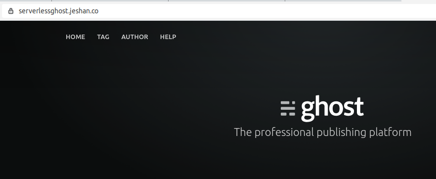
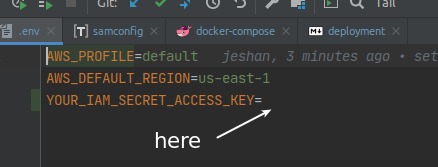

# serverless-ghost

The [Ghost](https://ghost.org/) project ported to AWS Lambda.

# Features
## Known to work
> Don't expect 100% feature parity yet!
- [x] Basic CRUD of posts and pages
- [x] Emails
- [x] CDN
- [x] Integration with Sentry (though they don't really advertise it)
- [x] Upload themes
- [x] Upload images and assets

## Additional features
`serverless-ghost` provides a few facilities:
- Easy deployment with Docker Compose.
- Generate static site.

## AWS integrations
The following are made possible/easier with `serverless-ghost`:
- Serve Ghost on your own domain (through Api Gateway).
- Creates a VPC dedicated to your Ghost installation.
- Free SSL certificates with Certificate Manager.
- Send emails with Amazon SES (e.g "forgot password" and welcome emails)
- Option to use regular Mysql or Aurora serverless
- Filesystem to host themes and other content with Amazon EFS
- Upload assets onto Amazon S3
- Deliver assets via Amazon CloudFront CDN
- Secure access to your database with VPC and tight security groups
- Automated IAM setup for Ghost to interact with the various services

# Deployment instructions

## TLDR
- Put your desired `DomainName` and deployment bucket `s3_bucket` in [samconfig.toml](samconfig.toml)
- Run `docker-compose up deploy`
- Check output for how to validate your SSL certificate.
- Put the stack output `WebsiteDns` as CNAME in your dns settings
- Hit the `PingUrl` given in the stack output
- Access the blog at `https://${DomainName}`

## The details
`serverless-ghost` essentially runs as a monolith on a single Lambda function (aka "Lambdalith" :grimacing: )

### First things first
You really need [Docker](https://docs.docker.com/get-docker/) to deploy this project. This is because Ghost release versions are already available as Docker images, relieving us of maintaining a separate fork for it in this repository. Here, we can just take its contents and package the Lambda code out of it.

Also, [Docker Compose](https://docs.docker.com/compose/install/) is recommended to make some commands a bit simpler.

### Orchestration
The deployment process uses AWS SAM CLI behind the scenes.
It needs a bucket where code artefacts and Cloudformation templates are deployed. Specify it under `s3_bucket` in [samconfig.toml](samconfig.toml).

> Otherwise, let sam create one for you as [described here](https://aws.amazon.com/blogs/compute/a-simpler-deployment-experience-with-aws-sam-cli/).

`serverless-ghost` CloudFormation parameters are to be declared here:

Next, you need a domain name where the blog will be reachable, e.g `ghost.johnnyserverless.com`. Declare it where `DomainName` is indicated in `samconfig.toml`. This will become the Api Gateway domain behind which the serverless function will be reachable.
> If you're thinking of skipping step by hitting the url provided by Api Gateway, you will see many Ghost routes return 404. I could fix it but I'm too lazy to go patch the Ghost code.

Next, run the deployment command:

`docker-compose up --build deploy`

Confirm intended params are being picked up by SAM:

This should go smoothly assuming you have the proper permissions. This process will create many resources, including:
- A Certificate Manager ssl certificate.
> You need to check the deployment output on how to validate it by DNS validation. Deployment will not complete unless you do this
- A VPC specific to `serverless-ghost`.
> That's mostly to simplify deployment and you could replace it with your own.
- An IAM access key for a new user
> It will be used by S3 and SES.

It will also create a CloudFront distribution and do many other things, including configure Ghost to use the various AWS services.

The first deployment should be doable within 10 minutes. After deployment, you will see the DNS record that you need to put for the installation to be accessible:

Put this for the domain at your registrar:

## Cold start
After first deployment, we need to let Ghost do its initialisation, e.g copy themes and populate the database. To do so, hit the ping url given in the cfn output,

e.g run

`curl  https://ghost.johnnyserverless.com/ghost/api/v3/admin/site/`

Give it about 1 minute to run __even__ if the request times out. Initialisation is still going on.
Try again in a few seconds.
When all is done, you should be able to use the blog properly at your configured domain:

## Additional deployment instructions
> I've tried to optimise the defaults for fast stack creation and/or create cheap resources. The process is not designed to be as flexible as possible. e.g allocating specific amount of storage is not parameterised. You need to modify the [template.yaml](template.yaml) if you want more specific customisations.

You can change AWS cli profile used by SAM by setting the `profile` key in `samconfig.toml`.

### Internet access
You will need a NAT gateway for outbound traffic, e.g for Ghost to send forgot password emails. Since NAT gateways are expensive to run, the default here is to not create it. To do so, set the `EnableNat` parameter to be `true`. 

### Emails
`serverless-ghost` provides out-of-the-box support for email (only) via Amazon SES.
To enable SES, you need to provide `SesSmtpPassword`. You need to generate that password from the created IAM user's secret access key.
- Uncomment the `SecretAccessKey` [template](template.yaml) output here:

- Redeploy the stack to get the said value: `docker-compose up --build deploy`
- Paste that value in [docker-compose.yml](docker-compose.yml) here:

- Run `docker-compose up smtp-password`
- Check the output for the smtp password:

- Put this value as `SesSmtpPassword` parameter

- Redeploy the stack so that Ghost can get the password: `docker-compose up --build deploy`

Other parameters to be aware of:
- `DatabasePassword`: Ghost will use this master user's password in the current setup to simplify deployment. Please set a more reasonable one than the default!
- `EnableDebugLogs`: ensure it's true so that you can attach the logs when investigating issues.
- `SentryDsn`: If you like to [use Sentry](https://sentry.io/welcome) for error monitoring, provide the DSN from a Sentry project.
- `Memory`: Number of megabytes to allocate to the serverless function. It will mostly help just to reduce cold start times.
- `UseServerlessDb`: Uses an Aurora serverless database if `true`. Otherwise, it uses an RDS Mysql `db.t3.micro`

> Feel free to edit [template.yaml](template.yaml) for more flexibility.

Deployment tested in us-east-1. Let me know if otherwise there are any issues.

# Caveats
> Please remember that Ghost is [**meant to be always running**](https://forum.ghost.org/t/serverless-ghost/6318/2) so we probably won't be able to leverage all features with `serverless-ghost`. If there are any issues, please raise them.

Some Ghost background processes may need to be run but are paused by Lambda when no invocations. If no invocations are coming, then it's unclear how Ghost will handle such situations.
Taking the above in consideration, note that:

- If changing themes, give it a few seconds to take effect. (I think this is how Ghost normally works anyway). You will see a "site starting up" message when accessing the website.
- If you're seeing an "internal server error" and you're seeing a ghost migration issue in the Lambda logs, then this is because the serverless function has been hit too many times while still initialising the database.
You can work around it by running the query `update migrations_lock set locked = false, released_at = curdate();`.
> At at now, only Aurora Serverless allows to run queries via the api/console.

# Licensing
Custom code provided in this repository is released under the [Simplified BSD Licence](LICENCE).

This project includes code Copyright 2017 Amazon.com, Inc. or its affiliates. All Rights Reserved. See [LICENCE-SAMPLECODE](LICENCE-SAMPLECODE) for details.

The [index.js](index.js) is taken from the upstream project and is Copyright (c) 2013-2020 Ghost Foundation. See [LICENCE-Ghost](LICENCE-Ghost) for details.
