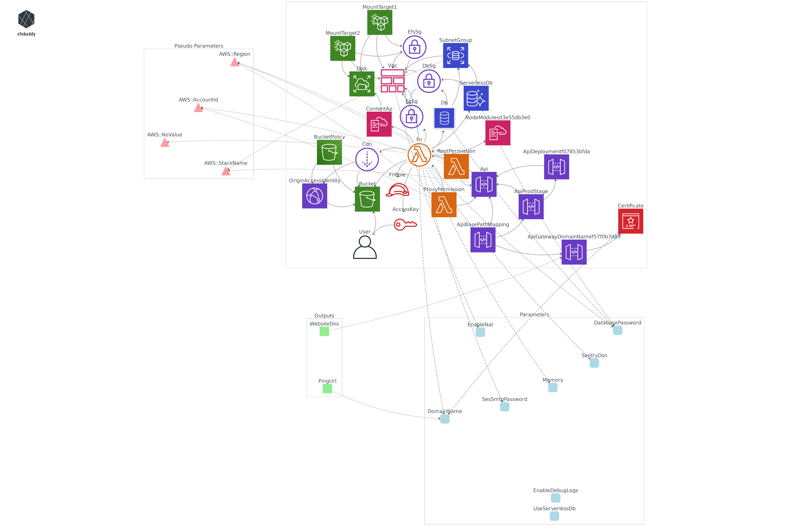

# serverless-ghost

> The [Ghost](https://ghost.org/) project ported to AWS Lambda.

`serverless-ghost` is the easiest way to get a professional blogging platform running (mostly) on serverless technologies on AWS.

> Caution: Beta software, here be dragons!

# Features
## Known to work
> Don't expect 100% feature parity yet!
- [x] Basic CRUD of posts and pages
- [x] Emails
- [x] CDN
- [x] Integration with Sentry (though they don't really advertise it)
- [x] Upload themes
- [x] Upload images and assets
- [x] Api keys

## Untested
> They _may_ work.

- [ ] Webhooks
- [ ] Newsletters 
- [ ] Update new versions of Ghost (but it _should_ work) 

## Additional features
`serverless-ghost` provides a few facilities:
- Secure [VPC](vpc-privatepublic.yaml) creation.
- Easy [deployment](deployment.md) with Docker Compose.
- Generate a [static site](deployment.md#static-site) for it.

## AWS integrations
The following are made possible/easier with `serverless-ghost`:
- Serve Ghost on your own domain (through Api Gateway).
- Creates a VPC dedicated to your Ghost installation.
- Free SSL certificates with Certificate Manager.
- Send emails with Amazon SES (e.g "forgot password" and welcome emails)
- Option to use regular Mysql or Aurora serverless
- Filesystem to host themes and other content with Amazon EFS
- Upload assets onto Amazon S3
- Deliver assets via Amazon CloudFront CDN
- Secure access to your database with VPC and tight security groups
- Automated IAM setup for Ghost to interact with the various services

# Deployment instructions

## TLDR
- Click Launch stack:  
- Declare your desired `DomainName` stack parameter.
- Check output for how to validate your SSL certificate.
- Put the stack output `WebsiteDns` as CNAME in your dns settings
- Hit the `PingUrl` given in the stack output
- Access the blog at `https://${DomainName}`

This is what will get deployed:

*Image automatically generated with [cfnbuddy](https://www.cfnbuddy.com)*

## The details
I expanded on the above in the [deployment.md](deployment.md) file. There are explanations, screenshots and documented issues there. Please read through it to make the most out of this project.

## Non-goals
Making Ghost cloud-native or any form of re-architecting is out of scope. However, we do want to leverage AWS integrations where sensible as long as maintaining a separate fork is not required.

# Licensing
Custom code provided in this repository is released under the [Simplified BSD Licence](LICENCE).

This project includes code Copyright 2017 Amazon.com, Inc. or its affiliates. All Rights Reserved. See [LICENCE-SAMPLECODE](LICENCE-SAMPLECODE) for details.

Upstream project is Copyright (c) 2013-2020 Ghost Foundation. See [LICENCE-Ghost](LICENCE-Ghost) for details.
